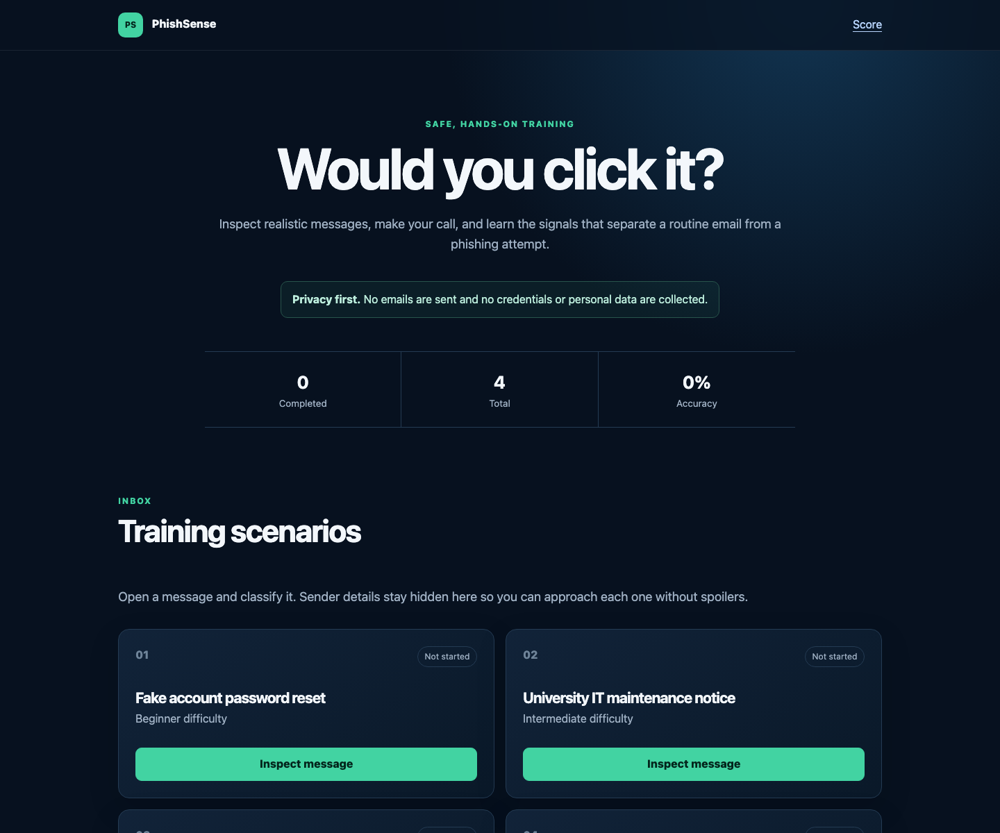

# PhishSense

[](https://adoptium.net/)
[](LICENSE)
[](https://render.com/deploy?repo=https://github.com/giovanipaul/PhishSense)

PhishSense is a privacy-friendly phishing awareness simulator. Learners inspect realistic—but fictional—email scenarios, classify each message, and receive immediate evidence-based feedback.



> [!IMPORTANT]
> This project is strictly for defensive education. It does not send or receive email, collect credentials, track users, or connect to scenario domains.

## Features

- Scenarios across multiple difficulty levels
- Evidence-based explanations and safe-action guidance
- Session-only completion and accuracy tracking
- Responsive, keyboard-accessible interface
- Reserved `.invalid` and `.example` domains
- Defensive HTTP headers and privacy-preserving session settings
- Tests, JaCoCo coverage, GitHub Actions CI, and Dependabot

## Run

Requires Java 17 or newer. Maven is not required globally.

```bash
./mvnw spring-boot:run
```

Open [http://localhost:8080](http://localhost:8080). On Windows use `.\mvnw.cmd spring-boot:run`.

## Test and package

```bash
./mvnw verify
java -jar target/phish-awareness-sim-1.0.0-SNAPSHOT.jar
```

Reports are generated under `target/surefire-reports/` and `target/site/jacoco/`.

## Deploy

The repository includes a production-ready multi-stage Docker build and a Render Blueprint. Click **Deploy to Render** above, review the free web service, and approve the Blueprint.

Render uses the platform-provided `PORT`, checks `/` for service health, and deploys updates from `main` only after CI succeeds.

> [!NOTE]
> Render's free web services can spin down while idle, so the first request after a quiet period may take longer.

## Customize scenarios

Edit [`ScenarioRepository.java`](src/main/java/com/example/phishsim/ScenarioRepository.java). Use a unique ID, reserved domains, balanced evidence, and a safe next action. Never add credential collection, active phishing infrastructure, real personal information, or outbound messaging.

## Privacy and limitations

Progress exists only in the server-side HTTP session. There is no database, analytics, authentication, outbound email, or credential field. This is an awareness exercise—not an email-security scanner—and a single indicator rarely proves intent.

See [CONTRIBUTING.md](CONTRIBUTING.md), [SECURITY.md](SECURITY.md), and the [MIT License](LICENSE).
